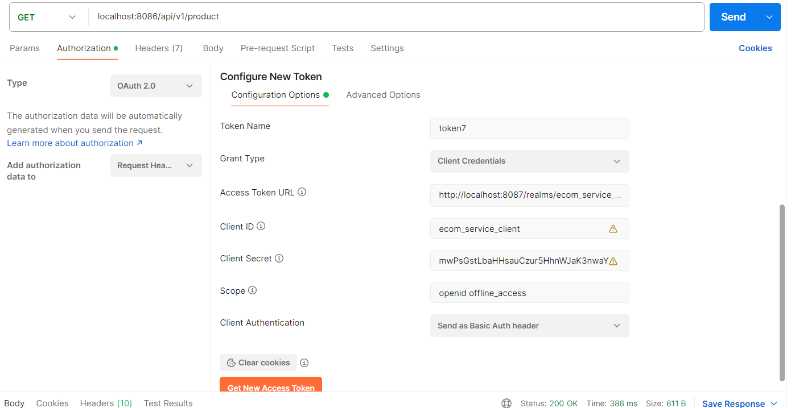

Starting Keycloak server container on port 8087 :
docker run -d -p 8087:8080 -e KEYCLOAK_ADMIN=admin -e KEYCLOAK_ADMIN_PASSWORD=admin quay.io/keycloak/keycloak:23.0.6 start-dev

------------
OAuth2 token generation

Zipkin Docker Run :
docker run -d -p 9411:9411 openzipkin/zipkin